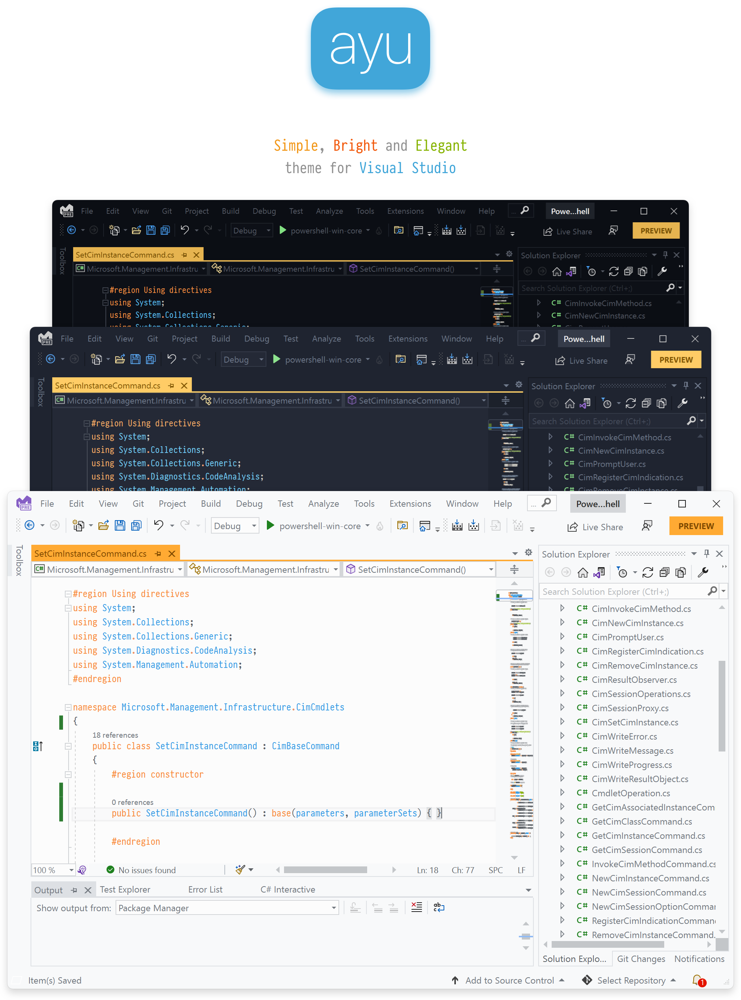

# Ayu Theme for Visual Studio 2026



A simple theme with bright colors that comes in three versions — **Dark**, **Mirage**, and **Light** — for all-day comfortable work.

> All screenshots use the wonderful [Pragmata Pro](https://fsd.it/shop/fonts/pragmatapro/) font.

## About

This is a **port of the original [ayu theme](https://github.com/dempfi/ayu)** by [Ike Kuruvilla (dempfi)](https://github.com/dempfi), adapted for **Visual Studio 2026**.

The original ayu theme was designed for Sublime Text and later ported to Visual Studio Code, JetBrains IDEs, and other editors. The existing Visual Studio port (https://github.com/ayu-theme/visual-studio) was built for Visual Studio 2022 and earlier, using the legacy theme system.

Visual Studio 2026 introduced a completely redesigned Fluent-based theme system with a new set of semantic color tokens. The old `.pkgdef`-based themes do not provide full coverage on VS 2026, leaving many IDE surfaces with default colors. This port rewrites the theme from scratch using the VS 2026 token system, providing complete coverage of the shell, editor, and IDE chrome.

### Features

- **Three themes** — Ayu Dark, Ayu Mirage, and Ayu Light.
- **Native VS 2026 support** — Built against the Fluent design system and the official `VsixColorCompiler` toolchain.
- **Full token coverage** — Every shell token from the official VS 2026 reference is themed, including status bar, tabs, tool window headers, menus, and editor surfaces.
- **Accent color integration** — The Ayu accent (gold for Dark, orange for Light) is used for buttons, focus indicators, selection, and interactive states.
- **Semantic syntax highlighting** — Roslyn-based semantic tokens for C#, plus XML, JSON, Markdown, regex, and URL classification.
- **Light theme with correct contrast** — Overlay tokens are inverted for light mode so text remains readable.

## Installation

### From the Visual Studio Marketplace

1. Open Visual Studio 2026.
2. Go to **Extensions → Manage Extensions**.
3. Search for **"Ayu Theme"**.
4. Click **Download** and restart Visual Studio.

### From the VSIX file

1. Download the latest `.vsix` from the [Releases page](https://github.com/[your-username]/ayu-vs2026/releases).
2. Double-click the file to install it into Visual Studio.
3. Restart Visual Studio.

### Applying a theme

1. Open **Tools → Options → Environment → General**.
2. Under **Color theme**, select **Ayu Dark**, **Ayu Mirage**, or **Ayu Light**.
3. Click **OK**.

## Compatibility

| Visual Studio Version | Supported |
|-----------------------|-----------|
| Visual Studio 2026 (18.x) | ✅ Yes |
| Visual Studio 2022 (17.x) | ⚠️ Partial — shell tokens are ignored, editor tokens apply |

Visual Studio 2022 uses the legacy theme system and does not recognize the Fluent shell tokens. On VS 2022, the editor syntax colors will apply but the shell chrome (status bar, tabs, tool window headers) will not. Full support requires VS 2026.

## Building from source

### Prerequisites

- Visual Studio 2026 with the **Visual Studio extension development** workload installed.
- The `VsixColorCompiler.exe` utility (ships with the VSSDK).

### Steps

1. Clone the repository:
```bash
git clone https://github.com/[your-username]/ayu-vs2026.git
cd ayu-vs2026
```

2. Run the build script to generate the `.pkgdef` from the `.vstheme` files:
```powershell
powershell -ExecutionPolicy Bypass -File build.ps1
```


3. Open `AyuTheme.slnx` in Visual Studio.

4. Press **F5** to launch the Experimental Instance. The themes should appear under **Tools → Options → Environment → General → Color theme**.

## Project structure
```
ayu-vs2026/
├── AyuTheme.csproj # SDK-style VSIX project
├── AyuTheme.slnx # Solution file
├── source.extension.vsixmanifest # VSIX manifest
├── build.ps1 # Combines .vstheme files and runs VsixColorCompiler
├── ayu_dark.vstheme # Ayu Dark theme (source of truth)
├── ayu_mirage.vstheme # Ayu Mirage theme
├── ayu_light.vstheme # Ayu Light theme
├── AyuTheme.xml # (generated) Combined theme XML
├── AyuTheme.pkgdef # (generated) Theme registration data
├── LICENSE.txt
├── NOTICE.txt
├── README.md
└── images/
	└── header.png
```

The `.vstheme` files are the source of truth. `AyuTheme.xml` and `AyuTheme.pkgdef` are generated artifacts and should not be edited by hand. They are listed in `.gitignore`.

## Credits

- **Original ayu theme** — [Ike Kuruvilla (dempfi)](https://github.com/dempfi/ayu)
- **Original Visual Studio port** — [ayu-theme/visual-studio](https://github.com/ayu-theme/visual-studio)
- **VS 2026 port** — [Adnan Rahmanpoor](https://github.com/adnanrahmanpoor)

## License

MIT. See [LICENSE.txt](LICENSE.txt) for details. The original ayu theme is also MIT-licensed. See [NOTICE.txt](NOTICE.txt) for full attribution.

## Issues

Found a bug or a token that isn't themed correctly? Please [open an issue](https://github.com/adnanrahmanpoor/ayu-vs2026/issues). Include your Visual Studio version, the theme you're using, and a screenshot of the problem if possible.